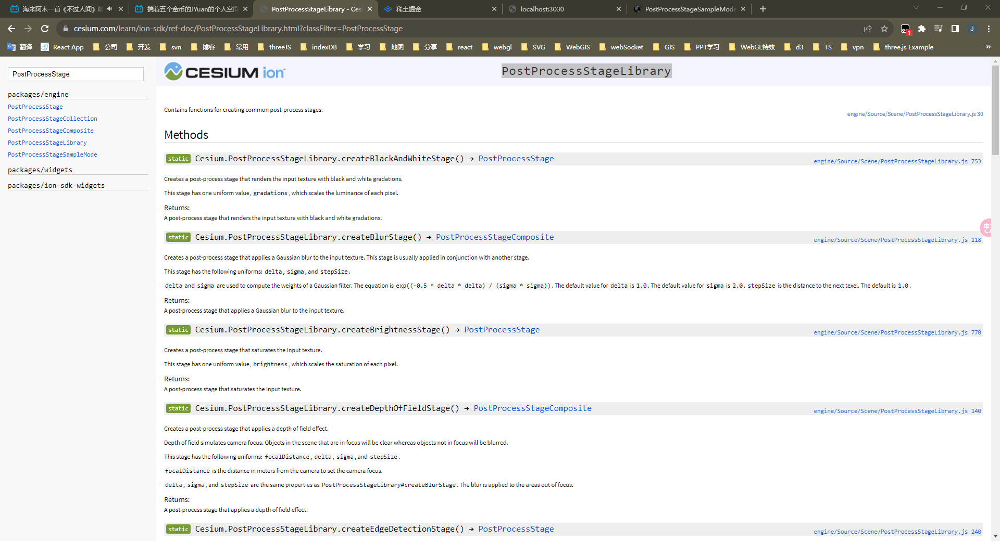
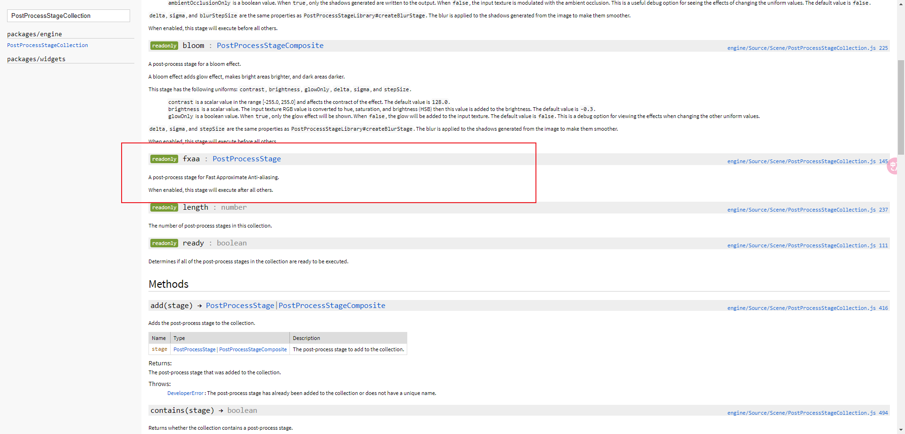
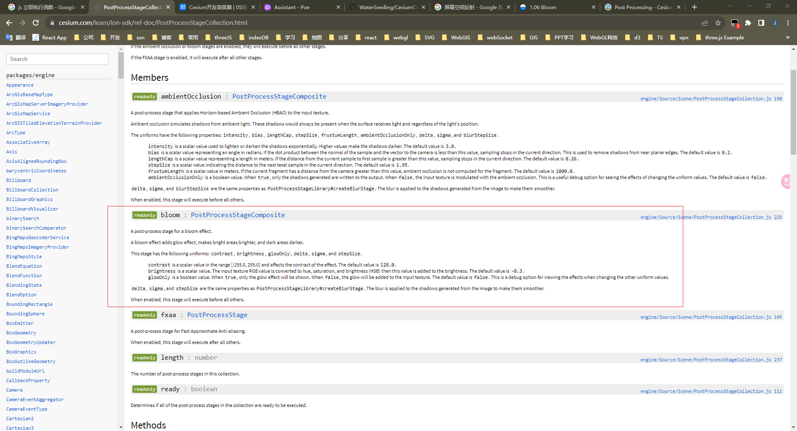
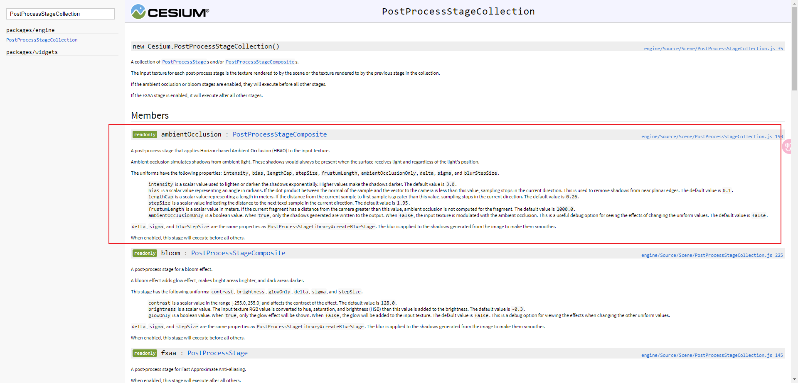

# Cesium 中的 PostProcessStageLibrary 库介绍(1)

> Cesium.js 的 PostProcessStageLibrary 是一个用于创建和应用后期处理效果的库。
>
> 以下是我整理记录的相关资料，帮助自己更好地接收了解 Cesium 中的后期处理(Post Processing)。
> 
> - [查看地址](https://cesium-post-process.vercel.app/)
> - [仓库地址](https://github.com/WaterSeeding/CesiumPostProcess)

<br />

## 介绍

PostProcessStageLibrary 库提供了一组预定义的后期处理效果，开发者可以使用这些效果来轻松地增强或修改 Cesium.js 应用程序中的渲染效果，并创造出更加逼真和引人注目的视觉感观。



如上图所示，包含：

- Bloom（泛光）
- FXAA（快速近似抗锯齿）
- Ambient Occlusion（环境遮蔽）
- Depth of Field（景深）
- Brightness (明亮度)
- HDR（高动态范围）
- Tone Mapping（色调映射）
- ...

一般的后期处理效果（如：景深、明亮度），有提供相应的`PostProcessStageLibrary`处理函数，但是某些后期处理效果（如：Bloom、FXAA、Ambient Occlusion），却是内置在`viewer.scene.postProcessStages`（初次执行的阶段渲染到的输出纹理），不需要添加额外的`PostProcessStage`或`PostProcessStageComposite`。

<br />

## FXAA（快速近似抗锯齿）

> Cesium 场景默认不开启（enabled 为 false）



<br />

### 说明

fxaa 效果的后期处理效果，添加抗锯齿效果。
启用后，此阶段将在所有其他阶段之后执行。

<br />

### 设置

1. 获取场景 fxaa 后期处理阶段：

```tsx
this.fxaa = this.viewer.scene.postProcessStages.fxaa;
```

2. 通过 GUI 可视化控件，修改 fxaa 属性值，来查看 fxaa 变化:

```ts
let fxaa_folder = gui.addFolder("Fxaa");
fxaa_folder.add({ show: true }, "show").onChange((v: boolean) => {
  viewer.scene.postProcessStages.fxaa.enabled = v;
});
```

<br />

## Bloom（泛光）

> Cesium 场景默认不开启（enabled 为 false）



<br />

### 说明

bloom 效果的后期处理效果，添加发光效果，使明亮区域更亮，使黑暗区域更暗。
启用后，此阶段将在所有其他阶段之前执行。

<br />

### uniforms

| 参数       | 类型    | 描述                                                                                              |
| ---------- | ------- | ------------------------------------------------------------------------------------------------- |
| glowOnly   | boolean | （默认值为 false）<br> 当 true 时，将仅显示发光效果。<br> 当 false 时，发光将被添加到输入纹理中。 |
| contrast   | number  | 对比度，[-255.0， 255.0] 范围内的标量值（默认值为 128.0）                                         |
| brightness | number  | 明亮度（ -0.3）                                                                                   |
| delta      | number  | 计算高斯滤波器的权重（默认值为 1.0）                                                              |
| sigma      | number  | 计算高斯滤波器的权重（默认值为 2.0 ）                                                             |
| stepSize   | number  | 到下一个纹素的距离（默认值为 1.0 ）                                                               |

<br />

### 设置

1. 获取场景 bloom 后期处理阶段：

```tsx
this.bloom = this.viewer.scene.postProcessStages.bloom;
```

2. 通过 GUI 可视化控件，修改 Bloom 属性值，来查看 Bloom 变化:

```ts
const reviseGui = (
  bloom: Cesium.PostProcessStageComposite,
  guiParams: BloomParamsInterface,
) => {
  bloom.enabled = Boolean(guiParams.show);
  bloom.uniforms.glowOnly = Boolean(guiParams.glowOnly);
  bloom.uniforms.contrast = Number(guiParams.contrast);
  bloom.uniforms.brightness = Number(guiParams.brightness);
  bloom.uniforms.delta = Number(guiParams.delta);
  bloom.uniforms.sigma = Number(guiParams.sigma);
  bloom.uniforms.stepSize = Number(guiParams.stepSize);
};
```

<br />

## Ambient Occlusion（环境遮蔽）

> Cesium 场景默认不开启（enabled 为 false）



<br />

### 说明

ambientOcclusion 效果的后期处理效果，设置场景环境光遮蔽。
环境光遮蔽模拟来自环境光的阴影。当表面接收光线时，无论光线的位置如何，这些阴影将始终存在。
启用后，此阶段将在所有其他阶段之前执行。

<br />

### uniforms

| 参数                 | 类型    | 描述                                                                                                                                                            |
| -------------------- | ------- | --------------------------------------------------------------------------------------------------------------------------------------------------------------- |
| intensity            | number  | 用于以指数方式使阴影变亮或变暗。值越高，阴影越暗。（默认值为 3.0）                                                                                              |
| bias                 | number  | 如果样本法线与相机矢量之间的点积小于此值，则采样将停止在当前方向上。（默认值为 0.1）                                                                            |
| lengthCap            | number  | 如果从当前样本到第一个样本的距离大于此值，则取样将停止在当前方向上。（默认值为 0.26）                                                                           |
| stepSize             | number  | 指示在当前方向上到下一个纹素样本的距离。（默认值为 1.95）                                                                                                       |
| frustumLength        | number  | 如果当前片段与相机的距离大于此值，则不会计算该片段的环境光遮蔽。（默认值为 1000.0）                                                                             |
| ambientOcclusionOnly | boolean | 这是一个有用的调试选项，用于查看更改统一值的效果。（默认值为 false）<br>当 true 时，只有生成的阴影被写入输出。<br>当 false 时，输入纹理使用环境光遮蔽进行调制。 |
| delta                | number  | 计算高斯滤波器的权重（默认值为 1.0）                                                                                                                            |
| sigma                | number  | 计算高斯滤波器的权重（默认值为 2.0 ）                                                                                                                           |
| stepSize             | number  | 到下一个纹素的距离（默认值为 1.0 ）                                                                                                                             |

<br />

### 设置

1. 获取场景 AmbientOcclusion 后期处理阶段：

```tsx
this.ambientOcclusion = this.viewer.scene.postProcessStages.ambientOcclusion;
```

2. 通过 GUI 可视化控件，修改 AmbientOcclusion 属性值，来查看 AmbientOcclusion 变化:

```ts
const reviseGui = (
  ambientOcclusion: Cesium.PostProcessStageComposite,
  guiParams: AmbientOcclusionParamsInterface,
) => {
  ambientOcclusion.enabled = Boolean(guiParams.show);
  ambientOcclusion.uniforms.ambientOcclusionOnly = Boolean(
    guiParams.ambientOcclusionOnly,
  );
  ambientOcclusion.uniforms.bias = Number(guiParams.bias);
  ambientOcclusion.uniforms.blurStepSize = Number(guiParams.blurStepSize);
  ambientOcclusion.uniforms.delta = Number(guiParams.delta);
  ambientOcclusion.uniforms.frustumLength = Number(guiParams.frustumLength);
  ambientOcclusion.uniforms.intensity = Number(guiParams.intensity);
  ambientOcclusion.uniforms.lengthCap = Number(guiParams.lengthCap);
  ambientOcclusion.uniforms.sigma = Number(guiParams.sigma);
  ambientOcclusion.uniforms.stepSize = Number(guiParams.stepSize);
};
```

<br />


<br />

## 相关资料

- [Cesium](https://cesium.com/)
- [Cesium Documentation](https://cesium.com/docs/)
